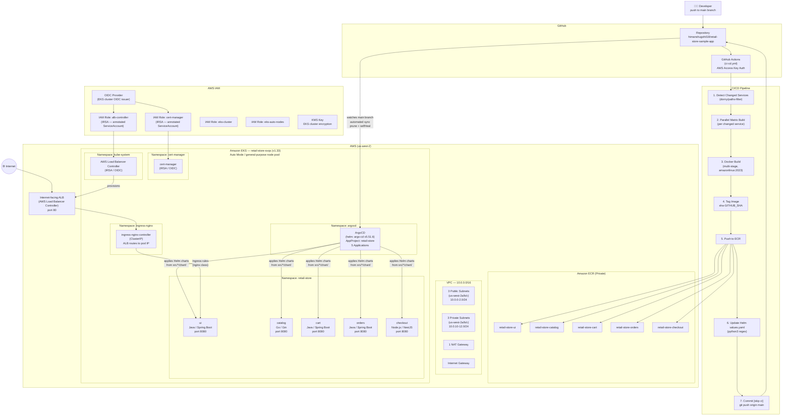

# Retail Store Sample App - GitOps with Amazon EKS Auto Mode


<div align="center">
  <div align="center">

[](Stars)


  </div>

  <strong>
  <h2>AWS Containers Retail Sample</h2>
  </strong>
</div>

This is a sample application designed to illustrate various concepts related to containers on AWS. It presents a sample retail store application including a product catalog, shopping cart and checkout, deployed using modern DevOps practices including GitOps and Infrastructure as Code.

---

# System Architecture

> **Evidence-based architecture documentation. Every component below is verified against the repository and Terraform state.**



---

## Architecture Overview

This project implements a **GitOps-based microservices deployment on Amazon EKS** with a fully automated CI/CD pipeline.

The flow is:

1. A developer pushes code to `main` — specifically within `src/ui/`, `src/catalog/`, `src/cart/`, `src/orders/`, or `src/checkout/`.
2. GitHub Actions detects which service directories changed.
3. Only the changed services are built as Docker images and pushed to private Amazon ECR.
4. The pipeline updates the corresponding `Helm values.yaml` with the new ECR image tag (`sha-<GITHUB_SHA>`).
5. That update is committed back to `main` with a `[skip ci]` message to prevent an infinite loop.
6. ArgoCD, watching the `main` branch, detects the Helm values change and applies a Kubernetes rolling update for the affected service.

Traffic reaches the application through an internet-facing ALB (provisioned by the AWS Load Balancer Controller via IRSA) which routes to the ingress-nginx controller running as ClusterIP inside the cluster.

---

## Infrastructure

All AWS infrastructure is managed by Terraform. The following resources are **verified in `terraform/terraform.tfstate`**:

| Category | Resource | Details |
|---|---|---|
| Networking | VPC | 10.0.0.0/16 |
| Networking | Public Subnets (3) | 10.0.0/24, 10.0.1/24, 10.0.2/24 — us-west-2a/b/c |
| Networking | Private Subnets (3) | 10.0.10/24, 10.0.11/24, 10.0.12/24 — us-west-2a/b/c |
| Networking | NAT Gateway (1) | Single NAT for cost control |
| Networking | Internet Gateway | Public subnet routing |
| Compute | Amazon EKS Cluster | `retail-store-svqs`, Kubernetes v1.33, Auto Mode |
| Compute | EKS Node Pool | `general-purpose` (EKS Auto Mode managed) |
| Security | KMS Key | EKS cluster secret encryption |
| Security | OIDC Provider | For IRSA (ALB Controller + cert-manager) |
| Security | IAM Role: alb-controller | Least-privilege ECR + ELB permissions via IRSA |
| Security | IAM Role: cert-manager | Route53/ACME permissions via IRSA |
| Security | IAM Role: eks-cluster | EKS control plane role |
| Security | IAM Role: eks-auto-nodes | EKS Auto Mode node role |
| Security | Security Group Rules | HTTP(80), HTTPS(443), healthcheck(10254), NodePort(30000-32767) |
| Registry | ECR (×5) | retail-store-{ui,catalog,cart,orders,checkout} |
| Registry | ECR Lifecycle Policies | Keep 10 tagged images, expire untagged after 1 day |
| Addons | ArgoCD | Helm chart `argo-cd v5.51.6`, namespace `argocd` |
| Addons | ingress-nginx | Helm, namespace `ingress-nginx`, ClusterIP |
| Addons | AWS Load Balancer Controller | Helm, namespace `kube-system`, IRSA |
| Addons | cert-manager | Helm, namespace `cert-manager`, IRSA |
| Ingress | ALB Ingress Resource | `alb-ingress-nginx`, internet-facing, target-type=ip |

**Not deployed:** Prometheus, Grafana, Filebeat, Elasticsearch, Kibana, CloudWatch Logs (monitoring is prepared but not enabled — `kube-prometheus-stack` is commented out in `addons.tf`).

---

## Containerization

All 5 services use **multi-stage Docker builds**:

| Service | Language | Build Base | Runtime Base | Non-root User |
|---|---|---|---|---|
| ui | Java 21 (Spring Boot) | amazonlinux:2023 + Maven | amazonlinux:2023 + Corretto 21 | appuser (UID 1000) |
| catalog | Go | amazonlinux:2023 + golang | amazonlinux:2023 | appuser (UID 1000) |
| cart | Java 21 (Spring Boot) | amazonlinux:2023 + Maven | amazonlinux:2023 + Corretto 21 | appuser (UID 1000) |
| orders | Java 21 (Spring Boot) | amazonlinux:2023 + Maven | amazonlinux:2023 + Corretto 21 | appuser (UID 1000) |
| checkout | Node.js 20 (NestJS) | node:20-alpine | amazonlinux:2023 + nodejs20 | appuser (UID 1000) |

All images:
- Use multi-stage builds (separate build and runtime layers)
- Run as **non-root** user `appuser` (UID 1000, GID 1000)
- Drop all Linux capabilities (`capabilities.drop: [ALL]`)
- Use read-only root filesystem (`readOnlyRootFilesystem: true`)
- Are tagged with the full Git commit SHA (`sha-<GITHUB_SHA>`) when built by CI/CD
- Are pushed to **private** Amazon ECR repositories with **IMMUTABLE** tags

---

## Kubernetes / EKS

### Namespaces (verified in Terraform state)

| Namespace | Contents |
|---|---|
| `argocd` | ArgoCD server, repo-server, application-controller, redis |
| `ingress-nginx` | ingress-nginx-controller (ClusterIP) |
| `cert-manager` | cert-manager, cainjector, webhook |
| `kube-system` | AWS Load Balancer Controller |
| `retail-store` | 5 application Deployments + Services |

### Application Deployments (retail-store namespace)

Each service has a Helm chart at `src/<service>/chart/` containing:
- `Deployment` with `RollingUpdate` strategy (maxUnavailable: 1)
- `Service` of type `ClusterIP` (port 80)
- `ServiceAccount` (per service)
- `ConfigMap` (environment configuration)
- `HPA` template (disabled by default — `autoscaling.enabled: false`)
- `PodDisruptionBudget` template (disabled by default)
- Readiness probe (`/actuator/health/readiness` for Java, `/` for others)
- Resource limits and requests defined per service

Replica count: **1 per service** (default in `values.yaml`; HPA is configured but not enabled)

### Ingress Architecture

```
Internet
   ↓
ALB (internet-facing, port 80)
   ↓  [AWS Load Balancer Controller — target-type=ip]
ingress-nginx-controller (ClusterIP, pod IP)
   ↓  [nginx Ingress resources, ingressClassName=nginx]
retail-store services (ClusterIP, port 80)
```

The ingress-nginx controller runs as `ClusterIP` — not a LoadBalancer. The ALB was introduced to work around an `OperationNotPermitted` error that prevented NLB creation in the AWS account. This is documented in `addons.tf`.

---

## CI/CD Pipeline

**Workflow file:** `.github/workflows/ci-cd.yml`

**Trigger:** Push to `main` branch where any file under `src/ui/**`, `src/catalog/**`, `src/cart/**`, `src/orders/**`, or `src/checkout/**` changes. Also supports `workflow_dispatch` for manual rebuilds.

**AWS Authentication:** GitHub Secrets → AWS Access Key ID + Secret Access Key → IAM User → ECR

> Note: GitHub Actions uses long-lived IAM access keys (stored as GitHub Secrets: `AWS_ACCESS_KEY_ID`, `AWS_SECRET_ACCESS_KEY`). OIDC is used only for IRSA inside the EKS cluster (ALB Controller, cert-manager), not for GitHub Actions authentication.

**Actual pipeline flow:**

```
git push to main
      │
      ▼
Job 1: detect-changes
  dorny/paths-filter detects which src/ directories changed
  Builds a JSON matrix of only the changed services
      │
      ▼
Job 2: build-and-push (parallel, one runner per changed service)
      │
      ├─ Checkout repository
      ├─ Configure AWS credentials (access key auth)
      ├─ Login to Amazon ECR
      ├─ Compute image tag: sha-${GITHUB_SHA}
      ├─ docker build -t <ecr-registry>/retail-store-<service>:<tag> src/<service>/
      ├─ docker push <ecr-registry>/retail-store-<service>:<tag>
      ├─ Update src/<service>/chart/values.yaml
      │    image.repository = <ecr-registry>/retail-store-<service>
      │    image.tag        = sha-${GITHUB_SHA}
      │    (via python3 regex substitution)
      └─ git commit "ci: update <service> image to <tag> [skip ci]"
         git push origin HEAD:main
      │
      ▼
ArgoCD detects Helm values.yaml changed on main
      │
      ▼
ArgoCD applies updated Helm chart to retail-store namespace
      │
      ▼
Kubernetes rolling update for the affected service
```

**Key design decisions:**

- `concurrency: group: ci-cd-${{ github.ref }}, cancel-in-progress: false` — prevents races when multiple services are updated; queues rather than cancels.
- `[skip ci]` in the automated Helm commit message prevents the pipeline from re-triggering on its own commit.
- `fail-fast: false` on the matrix — one service failure does not stop others.
- The pipeline was verified to have run successfully: git history shows `d84d347 ci: update ui image to sha-b16c58c62806bc9de749fa1b30393babc0d9ed22 [skip ci]`.

---

## Helm

Each service has an independent Helm chart (`src/<service>/chart/`) for granular control over individual deployments.

An umbrella chart (`src/app/chart/`) bundles all services as sub-charts but is **not used** in the GitOps workflow on `main`. ArgoCD uses the individual per-service charts.

Key values configured per service:

| Setting | Value |
|---|---|
| `image.pullPolicy` | `Always` |
| `service.type` | `ClusterIP` |
| `service.port` | `80` |
| `securityContext.runAsNonRoot` | `true` |
| `securityContext.runAsUser` | `1000` |
| `securityContext.readOnlyRootFilesystem` | `true` |
| `securityContext.capabilities.drop` | `[ALL]` |
| `metrics.enabled` | `true` (annotations for Prometheus scraping configured) |
| `autoscaling.enabled` | `false` |
| `podDisruptionBudget.enabled` | `false` |

Prometheus scrape annotations are configured across all services (`prometheus.io/scrape: "true"`) — this prepares for metrics collection when a Prometheus stack is deployed.

---

## GitOps with Argo CD

**ArgoCD is deployed** via Terraform (`helm_release.argocd`, verified in `terraform.tfstate`).

**5 ArgoCD Applications + 1 AppProject** (all verified in Terraform state as `kubectl_manifest` resources):

| Application | Chart Path | Target Branch | Namespace |
|---|---|---|---|
| `retail-store-ui` | `src/ui/chart` | `main` | `retail-store` |
| `retail-store-catalog` | `src/catalog/chart` | `main` | `retail-store` |
| `retail-store-cart` | `src/cart/chart` | `main` | `retail-store` |
| `retail-store-orders` | `src/orders/chart` | `main` | `retail-store` |
| `retail-store-checkout` | `src/checkout/chart` | `main` | `retail-store` |

**Sync policy for all 5 applications:**
```yaml
syncPolicy:
  automated:
    prune: true       # removes Kubernetes resources deleted from Git
    selfHeal: true    # reverts manual changes made directly to the cluster
  syncOptions:
    - CreateNamespace=true
```

**ArgoCD AppProject (`retail-store`):**
- Source: `https://github.com/himanshugohil18/retail-store-sample-app`
- Destination namespace: `retail-store`
- Cluster resource whitelist: `Namespace`, `ClusterRole`, `ClusterRoleBinding`, `ClusterIssuer`
- Namespace resource whitelist: `ConfigMap`, `Secret`, `Service`, `ServiceAccount`, `Deployment`, `StatefulSet`, `Ingress`, `HorizontalPodAutoscaler`, `PodDisruptionBudget`

**GitOps principle in this project:**

- Git (`main` branch) is the **desired state**
- ArgoCD continuously **reconciles** actual Kubernetes state toward Git
- Any manual `kubectl apply` change is automatically reverted by `selfHeal`
- Deleted Git resources are automatically removed from the cluster by `prune`

**Sync waves** order deployment order: catalog/cart/orders/checkout at wave 1, ui at wave 2 (UI depends on backend services).

---

## Security

The following security controls are **verified in the repository**:

| Control | Evidence |
|---|---|
| Non-root container execution | All Dockerfiles create `appuser` UID 1000; all Helm charts set `runAsNonRoot: true`, `runAsUser: 1000` |
| Drop all Linux capabilities | All Helm charts: `capabilities.drop: [ALL]` |
| Read-only root filesystem | All Helm charts: `readOnlyRootFilesystem: true` |
| Immutable ECR image tags | `ecr.tf`: `image_tag_mutability = "IMMUTABLE"` — SHA-based tags cannot be overwritten |
| ECR image scanning | `ecr.tf`: `scan_on_push = true` (basic CVE scanning on every push) |
| ECR encryption | `ecr.tf`: `encryption_type = "AES256"` |
| EKS cluster secret encryption | KMS key (`aws_kms_key`) created and attached to EKS cluster |
| IRSA for ALB Controller | OIDC provider + dedicated IAM role with scoped permissions, not EC2 instance profile |
| IRSA for cert-manager | OIDC provider + dedicated IAM role |
| Private networking for workloads | EKS nodes in private subnets; only ALB in public subnets |
| ArgoCD RBAC | AppProject restricts source repo and destination namespace |
| Kubernetes ServiceAccounts | Each service has a dedicated ServiceAccount (created by Helm) |

---

## Engineering Challenges

These are **actual challenges encountered** during implementation, documented by the repository evidence:

### 1. NLB Creation Blocked — Switched to ALB Architecture

**Problem:** The AWS account did not permit NLB creation (`OperationNotPermitted` error). The original plan was to expose ingress-nginx directly via a Network Load Balancer.

**Evidence:** `addons.tf` contains a comment documenting this:
```hcl
# NLB creation is not supported in this AWS account.
# The ingress-nginx controller now runs as ClusterIP.
# An ALB (provisioned by AWS Load Balancer Controller) acts as the external-facing
# load balancer and forwards traffic to the nginx controller via NodePort.
```

**Solution:** Changed `ingress-nginx` service type from `LoadBalancer` to `ClusterIP`. Added an ALB Ingress resource (`alb_ingress.tf`) using the AWS Load Balancer Controller to provision an internet-facing ALB. The ALB forwards traffic to the ingress-nginx pod IP directly using `target-type=ip`.

**Result:** Application accessible via ALB DNS; ingress-nginx handles all internal routing rules.

### 2. EKS Auto Mode IMDSv2 Hop Limit — ALB Controller VPC Configuration

**Problem:** EKS Auto Mode nodes enforce IMDSv2 with a hop limit of 1, which means the AWS Load Balancer Controller pod cannot read the VPC ID from EC2 instance metadata.

**Evidence:** `addons.tf` documents this:
```hcl
# EKS Auto Mode nodes use IMDSv2 hop limit = 1, which means the LBC pod
# cannot introspect VPC ID from EC2 metadata. Pass it explicitly instead.
```

**Solution:** The VPC ID is passed explicitly as a Helm value (`vpcId = module.vpc.vpc_id`) to the Load Balancer Controller deployment.

### 3. CI/CD Pipeline — Preventing Infinite Loop on Helm Commit

**Problem:** The pipeline updates `values.yaml` and commits back to `main`, which would normally re-trigger the workflow, causing infinite loops.

**Evidence:** `ci-cd.yml` uses `[skip ci]` in the commit message:
```bash
git commit -m "ci: update ${{ matrix.service }} image to ${IMAGE_TAG} [skip ci]"
```

**Solution:** GitHub Actions skips workflow execution when the commit message contains `[skip ci]`. The pipeline also uses `concurrency` control to prevent race conditions when multiple services are updated simultaneously.

### 4. ArgoCD SharedResourceWarning — Individual vs Umbrella Charts

**Problem:** Running both the umbrella chart (`src/app/chart`) and individual per-service ArgoCD Applications simultaneously caused `SharedResourceWarning` — the same `ClusterIssuer` resource was owned by multiple ArgoCD apps.

**Evidence:** `BRANCHING_STRATEGY.md` documents this:
```yaml
# Problem: Same resources deployed by multiple applications
Error: ClusterIssuer/letsencrypt-prod is part of applications argocd/retail-store-app and retail-store-ui
```

**Solution:** Use only one deployment strategy per branch. The current `main` branch uses individual ArgoCD Applications only (umbrella chart not applied). The umbrella chart is documented as for the "main/demo" deployment mode.

### 5. Terraform Cluster Name Drift — Timestamp Tags

**Problem:** Using `timestamp()` in Terraform resource tags caused all tagged resources to appear as modified on every `terraform plan`, even when nothing had changed.

**Evidence:** `locals.tf` comment:
```hcl
# NOTE: CreatedDate removed — timestamp() re-evaluates on every plan and
# causes all tagged resources to appear as changed even when nothing changed.
```

**Solution:** Removed the `CreatedDate` timestamp tag from `common_tags`.

---

## Verified Metrics

Every metric is classified by evidence type.

| Metric | Value | Classification | Evidence |
|---|---|---|---|
| Application microservices | 5 | VERIFIED STATIC FACT | `src/ui`, `src/catalog`, `src/cart`, `src/orders`, `src/checkout` |
| Dockerfiles (multi-stage) | 5 | VERIFIED STATIC FACT | One Dockerfile per service directory |
| Individual Helm charts | 5 | VERIFIED STATIC FACT | `src/*/chart/` directories |
| ArgoCD Applications | 5 | VERIFIED STATIC FACT | `argocd/applications/*.yaml` + confirmed in `terraform.tfstate` |
| ArgoCD AppProjects | 1 | VERIFIED STATIC FACT | `argocd/projects/retail-store-project.yaml` |
| Private ECR repositories | 5 | VERIFIED STATIC FACT | `terraform.tfstate` — `aws_ecr_repository.services` (ui, catalog, cart, orders, checkout) |
| GitHub Actions workflows | 1 | VERIFIED STATIC FACT | `.github/workflows/ci-cd.yml` |
| CI/CD pipeline stages | 2 jobs (detect-changes, build-and-push) | VERIFIED STATIC FACT | `ci-cd.yml` |
| Terraform-managed AWS resource types | 15+ distinct types | VERIFIED STATIC FACT | `terraform.tfstate` |
| EKS Kubernetes version | 1.33 | VERIFIED STATIC FACT | `terraform.tfstate` — `aws_eks_cluster` |
| EKS cluster name | `retail-store-svqs` | VERIFIED STATIC FACT | `terraform.tfstate` |
| VPC CIDR | 10.0.0.0/16 | VERIFIED STATIC FACT | `main.tf` + `terraform.tfstate` |
| Availability Zones used | 3 (us-west-2a/b/c) | VERIFIED STATIC FACT | `terraform.tfstate` — subnet resources |
| Namespaces deployed | argocd, ingress-nginx, cert-manager, kube-system, retail-store | VERIFIED STATIC FACT | Terraform Helm releases + ArgoCD apps |
| Successful CI/CD pipeline run | 1 confirmed run | ACTUAL MEASURED RESULT | git log: `d84d347 ci: update ui image to sha-b16c58c...[skip ci]` |
| Deployment time | Not measured in repository | NOT MEASURED | No pipeline run logs available |
| Request throughput / latency | Not measured in repository | NOT MEASURED | No load test or APM data |
| Cost savings | Not measured in repository | NOT MEASURED | No baseline cost data |
| Uptime / availability | Not measured in repository | NOT MEASURED | No monitoring data collected |

---

## Resume Highlights

> Exactly 4 bullets. Based only on verified implementation. No fabricated metrics.

- **Architected and deployed a GitOps-driven microservices platform on Amazon EKS Auto Mode** using Terraform to provision the complete AWS infrastructure (VPC across 3 availability zones, EKS v1.33, 5 private ECR repositories, ALB, IAM roles) and ArgoCD to continuously reconcile 5 independent Helm-based application deployments from a single Git repository with automated prune and self-heal enabled.

- **Implemented a path-aware GitHub Actions CI/CD pipeline** that detects code changes per service directory using `dorny/paths-filter`, runs parallel matrix Docker builds only for changed services, tags each image with the full Git commit SHA, pushes to private Amazon ECR with immutable tags and scan-on-push, and automatically commits updated Helm `values.yaml` files back to `main` — triggering ArgoCD reconciliation without manual intervention.

- **Engineered a two-tier Kubernetes ingress architecture** to work within AWS account constraints: AWS Load Balancer Controller (deployed via IRSA using the EKS OIDC provider) provisions an internet-facing ALB that forwards traffic directly to pod IPs, fronting an ingress-nginx controller running as ClusterIP — resolving an `OperationNotPermitted` error that blocked direct NLB provisioning.

- **Applied container security hardening across all 5 services**: every Dockerfile uses multi-stage builds on Amazon Linux 2023, creates a dedicated non-root user (UID 1000), and every Helm chart enforces `runAsNonRoot: true`, drops all Linux capabilities, enables read-only root filesystem, and uses immutable ECR image tags — reducing the container attack surface without requiring privileged access.

---

## Interview-Ready Explanation

**What did you build?**
A production-style microservices platform with automated GitOps deployment on AWS. Five containerized services (Java, Go, Node.js) deployed on Amazon EKS through a fully automated CI/CD pipeline with ArgoCD reconciling Kubernetes state from a single Git repository.

**What is the architecture?**
Developer pushes code → GitHub Actions detects the changed service → Docker build → ECR push → Helm values update → ArgoCD detects the Git change → Kubernetes rolling update. Traffic flows: Internet → ALB → ingress-nginx (ClusterIP) → retail-store services.

**How does code move from GitHub to Kubernetes?**
A push to `main` in any `src/**/` path triggers the pipeline. GitHub Actions builds only the changed service, tags the image with the full commit SHA, pushes to the corresponding private ECR repo, then updates the Helm `values.yaml` and commits it back with `[skip ci]`. ArgoCD watches `main` and applies the new Helm values to the cluster automatically.

**How are Docker images built?**
Multi-stage builds: a builder stage (Maven/Go/Node.js) compiles the application, and a minimal Amazon Linux 2023 runtime stage copies only the compiled artifact. No build tooling in the final image.

**Where are images stored?**
Private Amazon ECR repositories — one per service (`retail-store-ui`, `retail-store-catalog`, etc.). Tags are immutable SHA-based. Lifecycle policies keep the 10 most recent tagged images and expire untagged images after 1 day.

**How does Helm fit in?**
Each service has its own Helm chart at `src/<service>/chart/`. The chart defines the Deployment, Service, ServiceAccount, ConfigMap, HPA template, and PDB template. The CI/CD pipeline updates `values.yaml` (`image.repository` and `image.tag`) via Python regex substitution. ArgoCD then deploys from that updated chart.

**How does ArgoCD fit in?**
ArgoCD is deployed to the `argocd` namespace via Terraform. Five Application resources point to each service's Helm chart path on the `main` branch. `automated.prune: true` removes resources that are deleted from Git. `automated.selfHeal: true` reverts any manual cluster changes. Sync waves (wave 1 = backends, wave 2 = UI) ensure deployment order.

**Why GitOps?**
Git is the single source of truth for the desired cluster state. Every deployment is a Git commit — making deployments auditable, reproducible, and rollback-able without direct `kubectl apply` commands. ArgoCD's self-heal prevents config drift.

**How are metrics collected?**
Prometheus scrape annotations are configured on all service pods (`prometheus.io/scrape: "true"`, `/actuator/prometheus`, `/metrics`). However, the Prometheus + Grafana stack (`kube-prometheus-stack`) is **prepared but not deployed** — it is commented out in `addons.tf`. The `monitoring-values.yaml` file contains the ready-to-deploy configuration for Prometheus, Grafana, kube-state-metrics, and node-exporter.

**How are logs collected?**
No log aggregation stack is deployed in this repository. There is no Filebeat, Elasticsearch, or Kibana configuration anywhere in the codebase or Terraform state.

**What does Terraform manage?**
The entire AWS foundation: VPC (CIDR, subnets, routing, NAT, IGW), EKS cluster and node pool, KMS key, OIDC provider, IAM roles and policies (for IRSA, cluster, nodes), ECR repositories with lifecycle policies, security group rules, and all Kubernetes add-ons via Helm (ArgoCD, ingress-nginx, AWS LBC, cert-manager), plus the ArgoCD Application and AppProject manifests via `kubectl_manifest`.

**What were the hardest problems?**
(1) The AWS account blocked NLB creation — solved by switching to an ALB + ClusterIP ingress-nginx architecture. (2) EKS Auto Mode's IMDSv2 hop limit prevented the ALB controller from reading VPC metadata — solved by passing `vpcId` explicitly. (3) The CI/CD pipeline commit loop — solved with `[skip ci]`.

**What can you prove with metrics?**
5 services, 5 ECR repos, 5 Helm charts, 5 ArgoCD Applications, 1 working CI/CD run confirmed in git history (`d84d347`), Kubernetes v1.33, VPC across 3 AZs. Deployment timing and performance metrics were not measured.

---

## Table of Contents

- [Overview](#overview)
- [Architecture](#architecture)
- [Prerequisites](#prerequisites)
- [Quick Start](#quick-start)
- [Branch Strategy](#branch-strategy)
- [Getting Started](#getting-started)
- [GitOps Workflow](#gitops-workflow)
- [EKS Auto Mode](#eks-auto-mode)
- [Infrastructure Components](#infrastructure-components)
- [CI/CD Pipeline](#cicd-pipeline)
- [Monitoring and Observability](#monitoring-and-observability)
- [Custom Implementation](#custom-implementation)
- [Cleanup](https://github.com/LondheShubham153/retail-store-sample-app/blob/main/README.md#step-12-cleanup)
- [Troubleshooting](#troubleshooting)

## Overview

The Retail Store Sample App demonstrates a modern microservices architecture deployed on AWS EKS using GitOps principles. The application consists of multiple services that work together to provide a complete retail store experience:


- **UI Service**: Java-based frontend
- **Catalog Service**: Go-based product catalog API
- **Cart Service**: Java-based shopping cart API
- **Orders Service**: Java-based order management API
- **Checkout Service**: Node.js-based checkout orchestration API


## Application Architecture

The application has been deliberately over-engineered to generate multiple de-coupled components. These components generally have different infrastructure dependencies, and may support multiple "backends" (example: Carts service supports MongoDB or DynamoDB).


| Component                  | Language | Container Image                                                             | Helm Chart                                                                        | Description                             |
| -------------------------- | -------- | --------------------------------------------------------------------------- | --------------------------------------------------------------------------------- | --------------------------------------- |
| [UI](./src/ui/)            | Java     | [Link](https://gallery.ecr.aws/aws-containers/retail-store-sample-ui)       | [Link](src/ui/chart/values.yaml)    | Store user interface                    |
| [Catalog](./src/catalog/)  | Go       | [Link](https://gallery.ecr.aws/aws-containers/retail-store-sample-catalog)  | [Link](src/catalog/chart/values.yaml)  | Product catalog API                     |
| [Cart](./src/cart/)        | Java     | [Link](https://gallery.ecr.aws/aws-containers/retail-store-sample-cart)     | [Link](src/cart/chart/values.yaml)     | User shopping carts API                 |
| [Orders](./src/orders)     | Java     | [Link](https://gallery.ecr.aws/aws-containers/retail-store-sample-orders)   | [Link](src/orders/chart/values.yaml)   | User orders API                         |
| [Checkout](./src/checkout) | Node     | [Link](https://gallery.ecr.aws/aws-containers/retail-store-sample-checkout) | [Link](src/checkout/chart/values.yaml) | API to orchestrate the checkout process |


## Infrastructure Architecture

The Infrastructure Architecture follows cloud-native best practices:

- **Microservices**: Each component is developed and deployed independently
- **Containerization**: All services run as containers on Kubernetes
- **GitOps**: Infrastructure and application deployment managed through Git
- **Infrastructure as Code**: All AWS resources defined using Terraform
- **CI/CD**: Automated build and deployment pipelines with GitHub Actions


## Quick Start

**Want to deploy immediately?** Follow these steps for a basic deployment:

1. **Install Prerequisites**: AWS CLI, Terraform, kubectl, Docker, Helm
2. **Configure AWS**: `aws configure` with appropriate credentials
3. **Clone Repository**: `git clone https://github.com/LondheShubham153/retail-store-sample-app.git`
4. **Deploy Infrastructure**: Run Terraform in two phases (see [Getting Started](#getting-started))
5. **Access Application**: Get load balancer URL and browse the retail store

**Need advanced GitOps workflow?** See [BRANCHING_STRATEGY.md](./BRANCHING_STRATEGY.md) for automated CI/CD setup.

## Branch Strategy

This repository uses a **dual-branch approach** for different deployment scenarios:

### 🌐 **Public Application (Main Branch)**
- **Purpose**: Simple deployment with public images
- **Images**: Public ECR (stable versions like v1.2.2)
- **Deployment**: Manual control with umbrella chart
- **Updates**: Manual only
- **Best for**: Demos, learning, quick testing, simple deployments

### 🏭 **Production (GitOps Branch)**
- **Purpose**: Full production workflow with CI/CD pipeline
- **Images**: Private ECR (auto-updated with commit hashes)
- **Deployment**: Automated via GitHub Actions
- **Updates**: Automatic on code changes
- **Best for**: Production environments, automated workflows, enterprise deployments

> **📚 For detailed branching strategy, CI/CD setup, and advanced workflows, see [BRANCHING_STRATEGY.md](./BRANCHING_STRATEGY.md)**

## Getting Started

### Prerequisites

1. **Install Prerequisites**: AWS CLI, Terraform, kubectl, Docker, Helm
2. **Configure AWS**: `aws configure` with appropriate credentials
3. **Clone Repository**: `git clone https://github.com/LondheShubham153/retail-store-sample-app.git`
4. **Deploy Infrastructure**: Run Terraform in two phases (see [Getting Started](#getting-started))
5. **Access Application**: Get load balancer URL and browse the retail store

### **Required Tools**

| Tool          | Version | Installation                                                                         |
| ------------- | ------- | ------------------------------------------------------------------------------------ |
| **AWS CLI**   | v2+     | [Install Guide](https://docs.aws.amazon.com/cli/latest/userguide/install-cliv2.html) |
| **Terraform** | 1.0+    | [Install Guide](https://developer.hashicorp.com/terraform/install)                   |
| **kubectl**   | 1.33+   | [Install Guide](https://kubernetes.io/docs/tasks/tools/)                             |
| **Docker**    | 20.0+   | [Install Guide](https://docs.docker.com/get-docker/)                                 |
| **Helm**      | 3.0+    | [Install Guide](https://helm.sh/docs/intro/install/)                                 |
| **Git**       | 2.0+    | [Install Guide](https://git-scm.com/downloads) 

Follow these steps to **install Prerequisites:**


### **Quick Installation Scripts**

<details>
<summary><strong>🔧 One-Click Installation</strong></summary>

```bash
#!/bin/bash
# Install all prerequisites

# AWS CLI
curl "https://awscli.amazonaws.com/awscli-exe-linux-x86_64.zip" -o "awscliv2.zip"
unzip awscliv2.zip
sudo ./aws/install

# Terraform
curl -fsSL https://apt.releases.hashicorp.com/gpg | sudo apt-key add -
sudo apt-add-repository "deb [arch=amd64] https://apt.releases.hashicorp.com $(lsb_release -cs) main"
sudo apt-get update && sudo apt-get install terraform

# kubectl
curl -LO "https://dl.k8s.io/release/v1.33.3/bin/linux/amd64/kubectl"
chmod +x kubectl
sudo mv kubectl /usr/local/bin/

# Docker
curl -fsSL https://get.docker.com -o get-docker.sh
sudo sh get-docker.sh

# Helm
curl https://raw.githubusercontent.com/helm/helm/main/scripts/get-helm-3 | bash

# Verify installations
aws --version
terraform --version
kubectl version --client
docker --version
helm version
```

</details>


## Follow these steps to deploy the application:

### Step 1. Configure AWS with **`Root User`** Credentials:

  Ensure your AWS CLI is configured with the **Root user credentials:**

```sh
aws configure
```

### Step 2. Clone the Repository:

```sh
git clone https://github.com/LondheShubham153/retail-store-sample-app.git
```

> [!IMPORTANT]
> ### Step 3: Choose Your Deployment Strategy
>
> **For Public Application (Main Branch):**
> - Uses stable public ECR images (v1.2.2)
> - Manual deployment control
> - No GitHub Actions required
> - Skip to Step 4 - infrastructure is ready
>
> **For Production (GitOps Branch):**
> - Uses private ECR with automated CI/CD
> - Requires GitHub Actions setup
> - See [BRANCHING_STRATEGY.md](./BRANCHING_STRATEGY.md) for complete setup


### Step 4. Deploy Infrastructure with Terraform:

```sh
cd retail-store-sample-app/terraform/
terraform init
terraform apply --auto-approve
```


This creates the core infrastructure, including:
- VPC with public and private subnets
- Amazon EKS cluster with Auto Mode enabled
- Security groups and IAM roles

And deploys:
- ArgoCD for Setup GitOps
- NGINX Ingress Controller
- Cert Manager for SSL certificates


### Step 5: Update kubeconfig to Access the Amazon EKS Cluster:
```
aws eks update-kubeconfig --name retail-store --region <region>
```

> Application is live with Public image:

- Get your ingress EXTERNAL-IP and paste it in the browser to access retail-store application.
    ```sh
    kubectl get svc -n ingress-nginx
    ```

> [!NOTE]
> Let's move forward with GitOps principle utilising Amazon private registry to create private registry and store images.

### Step 6: GitHub Actions (Production Branch Only)

> **Note**: This step is only required if you're using the **Production branch** for automated deployments. Skip this step if using the **Public Application branch** for simple deployment.

For GitHub Actions, first configure secrets so the pipelines can be automatically triggered:

**Create an IAM User, policies, and generate credentials**

**Go to your GitHub repo → Settings → Secrets and variables → Actions → New repository secret.**


| Secret Name           | Value                              |
|-----------------------|------------------------------------|
| `AWS_ACCESS_KEY_ID`   | `Your AWS Access Key ID`           |
| `AWS_SECRET_ACCESS_KEY` | `Your AWS Secret Access Key`     |
| `AWS_REGION`          | `region-name`                       |
| `AWS_ACCOUNT_ID`        | `your-account-id` |


> [!IMPORTANT]
> Once the entire cluster is created, any changes pushed to the repository will automatically trigger GitHub Actions.

GitHub Actions will automatically build and push the updated Docker images to Amazon ECR.


### Verify Deployment

Check if the nodes are running:

```bash
kubectl get nodes
```

### Step 7: Access the Application:

The application is exposed through the NGINX Ingress Controller. Get the load balancer URL:

```bash
kubectl get svc -n ingress-nginx
```

Use the EXTERNAL-IP of the ingress-nginx-controller service to access the application.


### Step 8: Argo CD Automated Deployment:

**Verify ArgoCD installation**

```
kubectl get pods -n argocd
```


### Step 9: Port-forward to Argo CD UI and login:

**Get ArgoCD admin password**
```
kubectl -n argocd get secret argocd-initial-admin-secret -o jsonpath='{.data.password}' | base64 -d
```

**Port-forward to Argo CD UI**
```
kubectl port-forward svc/argocd-server -n argocd 8080:443 &
```

Open your browser and navigate to:
https://localhost:8080

Username: admin 

Password: <output of previous command>

### Step 10: Access ArgoCD UI

Once ArgoCD is deployed, you can access the web interface:


The ArgoCD UI provides:
- **Application Status**: Real-time sync status of all services
- **Resource View**: Detailed view of Kubernetes resources
- **Sync Operations**: Manual sync and rollback capabilities
- **Health Monitoring**: Application and resource health status

### Step 11: Monitor Application Deployment

```bash
kubectl get pods -n retail-store
kubectl get ingress -n retail-store
```

### Step 12: Cleanup
To delete all resources created by Terraform:
```
terraform destroy --auto-approve
```


> [!NOTE]
> ECR Repositories you need to Delete it from AWS Console Manually.


## Custom Implementation

> **Project-specific additions**
>
> The original Retail Store Sample App functionality and documentation have been retained. The following section documents the DevOps, cloud, security, CI/CD, GitOps, and observability work added as part of this implementation.

### 1. AWS Infrastructure with Terraform

The project infrastructure was extended and managed through Terraform so that the environment can be reproduced as code.

Custom infrastructure work includes:

- Amazon EKS cluster and supporting AWS networking
- VPC, public/private subnet configuration, security groups, and IAM resources
- Amazon ECR repositories for the application services
- ECR lifecycle policies for managing image retention
- Kubernetes add-ons deployed through Terraform/Helm
- Terraform outputs for important cluster and CI/CD integration values

### 2. GitHub Actions CI/CD Pipeline

A custom GitHub Actions workflow was implemented for automated application delivery.

**Pipeline flow:**

```text
Developer Push
      │
      ▼
GitHub Actions
      │
      ▼
Detect Changed Services
      │
      ├── UI
      ├── Catalog
      ├── Cart
      ├── Orders
      └── Checkout
      │
      ▼
Build Only Changed Services
      │
      ▼
Docker Build
      │
      ▼
Tag Image with Git SHA
      │
      ▼
Push Image to Amazon ECR
      │
      ▼
Update Helm values.yaml
      │
      ▼
Commit Changes Back to Git
      │
      ▼
Argo CD Detects Git Change
      │
      ▼
EKS Rolling Deployment
```

The workflow also includes:

- Path-based change detection so unchanged services are not rebuilt.
- Parallel matrix builds for changed services.
- Immutable Git SHA image tags.
- Manual `workflow_dispatch` support for forced service rebuilds.
- Concurrency control to avoid competing image/version updates.
- Automatic Helm `values.yaml` updates after a successful image push.
- `[skip ci]` handling on the generated values commit to prevent an infinite CI loop.

### 3. AWS Authentication for CI/CD

GitHub Actions authenticates to AWS using **IAM Access Keys** stored as GitHub Secrets.

Required secrets:
- `AWS_ACCESS_KEY_ID`
- `AWS_SECRET_ACCESS_KEY`
- `AWS_ACCOUNT_ID`

Required variable:
- `AWS_REGION`

For service-to-AWS authentication **within the cluster** (AWS Load Balancer Controller, cert-manager), IRSA (IAM Roles for Service Accounts) is used via the EKS OIDC provider — these components do not use long-lived access keys.

### 4. Amazon ECR Image Management

Private ECR repositories were configured for the application services.

The CI/CD workflow:

1. Authenticates to AWS through IAM access keys.
2. Logs in to Amazon ECR.
3. Builds the changed service image.
4. Tags the image using the Git commit SHA.
5. Pushes the image to the corresponding private ECR repository.
6. Updates the Kubernetes Helm values with the new image reference.

ECR lifecycle policies are also used to prevent unlimited accumulation of old CI-generated images.

### 5. Argo CD GitOps Deployment

Argo CD was configured as the GitOps deployment controller for the Kubernetes workloads.

Custom GitOps work includes:

- Argo CD applications configured against this Git repository.
- Repository references updated to the project's GitHub repository.
- Helm-based application deployment.
- Automatic synchronization from Git to the EKS cluster.
- Application health and sync-status monitoring through the Argo CD UI.
- Kubernetes rolling updates triggered by Git changes.

The resulting deployment path is:

```text
GitHub Repository
      │
      ▼
GitHub Actions
      │
      ▼
Private Amazon ECR
      │
      ▼
Helm values.yaml updated in Git
      │
      ▼
Argo CD
      │
      ▼
Amazon EKS
      │
      ▼
Retail Store Services
```

### 6. Kubernetes Ingress and Application Exposure

The application was exposed through a two-tier ingress architecture:

- AWS Load Balancer Controller provisions an **internet-facing ALB**
- NGINX Ingress Controller runs as **ClusterIP** inside the cluster
- ALB routes traffic to ingress-nginx pod IP directly (target-type=ip)
- ingress-nginx routes to individual retail-store services
- cert-manager is deployed for certificate management

### 7. Monitoring Preparation

A `monitoring-values.yaml` file is included in the repository with a prepared configuration for the `kube-prometheus-stack` Helm chart, including:

- Prometheus (1 replica, 2-day retention)
- Grafana (1 replica)
- kube-state-metrics
- node-exporter

**Note:** The monitoring stack is not currently deployed. The `kube-prometheus-stack` configuration is commented out in `addons.tf` (`# enable_kube_prometheus_stack = var.enable_monitoring`). All service Helm charts have Prometheus scrape annotations pre-configured (`prometheus.io/scrape: "true"`) to support future monitoring deployment.

### 8. Operational Verification

The deployment was also verified using Kubernetes and Argo CD operational checks, including:

```bash
kubectl get nodes
kubectl get pods -n argocd
kubectl get pods -n retail-store
kubectl get ingress -n retail-store
kubectl get svc -n ingress-nginx
```

Argo CD was verified through its web UI, where the deployed retail-store applications were shown as healthy and synchronized.

### 9. Engineering Focus

The custom implementation focuses on the complete DevOps delivery lifecycle:

- Infrastructure as Code with Terraform
- Kubernetes on Amazon EKS
- Containerization with Docker
- Private image registry with Amazon ECR
- CI/CD with GitHub Actions (IAM access key authentication)
- GitOps with Argo CD
- Helm-based Kubernetes deployments
- Two-tier ingress and traffic exposure (ALB + ingress-nginx)
- Automated deployment and operational verification


## Troubleshooting

### Common Issues

#### **Image Pull Errors**
```
Error: Failed to pull image "123456789012.dkr.ecr.us-west-2.amazonaws.com/retail-store-ui:abc1234"
```
**Solutions**:
1. Ensure you're using the correct branch for your deployment strategy
2. For Production branch: Check GitHub Actions completed successfully
3. For Public Application branch: Verify you're using public ECR images
4. Check AWS credentials and ECR permissions

#### **GitHub Actions Not Triggering**
**Solutions**:
1. Ensure changes are in `src/` directory
2. Verify you're on the `main` branch
3. Check GitHub Actions is enabled in repository settings
4. Review [BRANCHING_STRATEGY.md](./BRANCHING_STRATEGY.md) for detailed setup

### Getting Help

- **Basic deployment issues**: Check this README
- **Advanced GitOps issues**: See [BRANCHING_STRATEGY.md](./BRANCHING_STRATEGY.md)
- **Infrastructure issues**: Review Terraform logs
- **Application issues**: Check ArgoCD UI and kubectl logs

## License

This project is licensed under the Apache License 2.0 - see the [LICENSE](./LICENSE) file for details.

## Support

- **Issues**: [GitHub Issues](https://github.com/LondheShubham153/retail-store-sample-app/issues)
- **Discord**: [TrainWithShubhamCommunity](https://discord.gg/kGEr9mR5gT)

---

<div align="center">

**⭐ Star this repository if you found it helpful!**

**🔄 For advanced GitOps workflows, see [BRANCHING_STRATEGY.md](./BRANCHING_STRATEGY.md)**

</div>
