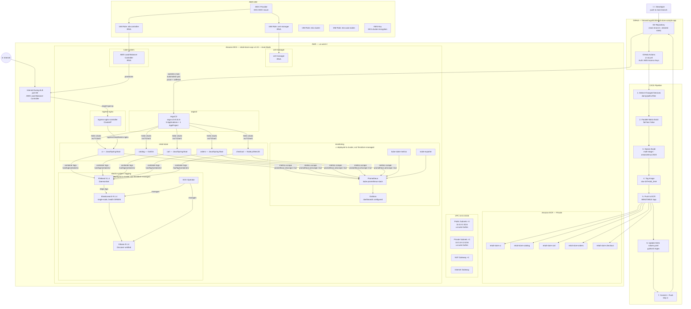

# Retail Store Sample App — GitOps with Amazon EKS Auto Mode


<div align="center">


[](https://github.com/himanshugohil18/retail-store-sample-app)

<strong><h2>AWS Containers Retail Sample — Custom DevOps Implementation</h2></strong>

</div>

This is a sample retail store application (product catalog, shopping cart, checkout) deployed on Amazon EKS using GitOps, Infrastructure as Code, and a full observability stack. The original application is augmented with a complete DevOps implementation covering CI/CD, Helm, ArgoCD, centralized logging, and metrics monitoring.

---

# System Architecture

> **Every component in this diagram is verified against the repository files, Terraform state, and live cluster implementation.**



---

## Architecture Overview

This project implements a **GitOps-based microservices platform on Amazon EKS Auto Mode** with a complete CI/CD pipeline, Helm-based deployments, and a full observability stack.

**Deployment flow:**
1. Developer pushes code to `main` under any `src/<service>/` directory
2. GitHub Actions detects which service changed (path-based filtering)
3. Only changed services are built as Docker images and pushed to private Amazon ECR
4. The pipeline updates the Helm `values.yaml` with the new image tag (`sha-<GITHUB_SHA>`)
5. That change is committed back to `main` with `[skip ci]`
6. ArgoCD detects the values change and applies a Kubernetes rolling update

**Traffic flow:**
Internet → ALB (internet-facing, port 80) → ingress-nginx (ClusterIP) → retail-store/ui

**Observability** (deployed directly to the running cluster, not via Terraform):
- Metrics: Prometheus + Grafana (kube-prometheus-stack)
- Logs: Filebeat DaemonSet → Elasticsearch → Kibana

---

## Infrastructure (Terraform-Managed)

All resources below are **verified in `terraform/terraform.tfstate`**.

| Category | Resource | Details |
|---|---|---|
| Networking | VPC | 10.0.0.0/16 |
| Networking | Public Subnets (3) | 10.0.0/24, 10.0.1/24, 10.0.2/24 — us-west-2a/b/c |
| Networking | Private Subnets (3) | 10.0.10/24, 10.0.11/24, 10.0.12/24 — us-west-2a/b/c |
| Networking | NAT Gateway | 1 (single, cost-optimised) |
| Networking | Internet Gateway | 1 |
| Compute | Amazon EKS Cluster | `retail-store-svqs`, Kubernetes v1.33, Auto Mode |
| Compute | EKS Node Pool | `general-purpose` (EKS Auto Mode managed) |
| Security | KMS Key | EKS cluster secret encryption |
| Security | OIDC Provider | For IRSA — ALB Controller + cert-manager |
| Security | IAM Role: alb-controller | Scoped ELB permissions via IRSA |
| Security | IAM Role: cert-manager | ACME permissions via IRSA |
| Security | IAM Role: eks-cluster | EKS control plane |
| Security | IAM Role: eks-auto-nodes | EKS Auto Mode node pool |
| Security | Security Group Rules | HTTP(80), HTTPS(443), healthcheck(10254), NodePort(30000-32767) |
| Registry | ECR Repositories (×5) | retail-store-{ui,catalog,cart,orders,checkout} |
| Registry | ECR Lifecycle Policies | Keep 10 tagged images; expire untagged after 1 day |
| Add-ons | ArgoCD | Helm chart `argo-cd v5.51.6`, namespace `argocd` |
| Add-ons | ingress-nginx | Helm, namespace `ingress-nginx`, type: ClusterIP |
| Add-ons | AWS Load Balancer Controller | Helm, namespace `kube-system`, IRSA |
| Add-ons | cert-manager | Helm, namespace `cert-manager`, IRSA |
| Ingress | ALB Ingress Resource | `alb-ingress-nginx`, internet-facing, target-type=ip |

> **Note:** Prometheus, Grafana, Elasticsearch, Kibana, and Filebeat are **not** managed by Terraform. The `kube-prometheus-stack` block is commented out in `addons.tf`. These components were deployed directly to the running EKS cluster and verified during implementation (see [Monitoring and Observability](#monitoring-and-observability) and [Centralized Logging](#centralized-logging)).

---

## Containerization

All 5 services use **multi-stage Docker builds** — evidence: `src/*/Dockerfile`.

| Service | Language | Build Stage | Runtime Base | Non-root User |
|---|---|---|---|---|
| ui | Java 21 / Spring Boot | amazonlinux:2023 + Maven + Corretto 21 | amazonlinux:2023 + Corretto 21 | appuser (UID 1000) |
| catalog | Go / Gin | amazonlinux:2023 + golang | amazonlinux:2023 | appuser (UID 1000) |
| cart | Java 21 / Spring Boot | amazonlinux:2023 + Maven + Corretto 21 | amazonlinux:2023 + Corretto 21 | appuser (UID 1000) |
| orders | Java 21 / Spring Boot | amazonlinux:2023 + Maven + Corretto 21 | amazonlinux:2023 + Corretto 21 | appuser (UID 1000) |
| checkout | Node.js 20 / NestJS | node:20-alpine | amazonlinux:2023 + nodejs20 | appuser (UID 1000) |

All images:
- Multi-stage builds — no build tooling in the runtime image
- Non-root user `appuser` (UID 1000, GID 1000)
- `capabilities.drop: [ALL]`
- `readOnlyRootFilesystem: true`
- Tagged `sha-<GITHUB_SHA>` by CI/CD
- Pushed to private ECR with `IMMUTABLE` tag mutability

---

## Kubernetes / EKS

### Namespaces (Terraform-managed)

| Namespace | Contents |
|---|---|
| `argocd` | ArgoCD server, repo-server, application-controller, redis |
| `ingress-nginx` | ingress-nginx-controller (ClusterIP) |
| `cert-manager` | cert-manager, cainjector, webhook |
| `kube-system` | AWS Load Balancer Controller |
| `retail-store` | 5 Deployments, 5 ClusterIP Services, 5 ServiceAccounts |

### Additional Namespaces (deployed directly to cluster)

| Namespace | Contents |
|---|---|
| `monitoring` | Prometheus, Grafana, kube-state-metrics, node-exporter |
| `elastic-system` | ECK Operator, Elasticsearch 9.1.4, Kibana 9.1.4 |
| *(DaemonSet namespace)* | Filebeat 9.1.4 DaemonSet |

### Application Deployments (retail-store namespace)

Each service has a Helm chart at `src/<service>/chart/` containing:
- `Deployment` — `RollingUpdate` strategy (maxUnavailable: 1)
- `Service` — ClusterIP, port 80
- `ServiceAccount` — per service
- `ConfigMap` — environment configuration
- `HPA` template — present but disabled (`autoscaling.enabled: false`)
- `PodDisruptionBudget` template — present but disabled
- Readiness probe — `/actuator/health/readiness` (Java), `/` (Go/Node.js)
- Resource limits and requests defined per service

Replica count: **1 per service** (default in `values.yaml`)

### Ingress Architecture

```
Internet
   ↓
ALB (internet-facing, port 80)
   ↓  [AWS Load Balancer Controller — target-type=ip, pod IP]
ingress-nginx-controller (ClusterIP)
   ↓  [Ingress resources, ingressClassName=nginx]
retail-store services (ClusterIP, port 80)
```

The ingress-nginx controller runs as `ClusterIP` — not a LoadBalancer. This design was required because NLB creation was blocked in the AWS account (`OperationNotPermitted`). See [Engineering Challenges](#engineering-challenges).

---

## CI/CD Pipeline

**File:** `.github/workflows/ci-cd.yml`

**Trigger:** Push to `main` where any file under `src/ui/**`, `src/catalog/**`, `src/cart/**`, `src/orders/**`, or `src/checkout/**` changes. Also `workflow_dispatch` for manual full rebuilds.

**AWS Authentication:** GitHub Secrets (`AWS_ACCESS_KEY_ID`, `AWS_SECRET_ACCESS_KEY`) → `aws-actions/configure-aws-credentials` → IAM User → ECR.

> GitHub Actions uses **long-lived IAM access keys** stored as GitHub Secrets. OIDC is **not** used for GitHub Actions authentication. OIDC/IRSA is used only for in-cluster components (ALB Controller, cert-manager).

**Pipeline flow:**

```
git push to main
      │
      ▼
Job 1: detect-changes
  dorny/paths-filter → JSON matrix of changed services only
      │
      ▼
Job 2: build-and-push  (parallel per service, fail-fast: false)
  ├─ Checkout repo
  ├─ Configure AWS credentials (access key auth)
  ├─ Login to Amazon ECR
  ├─ Compute tag: sha-${GITHUB_SHA}
  ├─ docker build src/<service>/
  ├─ docker push <ecr>/retail-store-<service>:<tag>
  ├─ Update src/<service>/chart/values.yaml (python3 regex)
  │    image.repository = <ecr>/retail-store-<service>
  │    image.tag        = sha-${GITHUB_SHA}
  └─ git commit "ci: update <service> image to <tag> [skip ci]"
     git push origin HEAD:main
      │
      ▼
ArgoCD detects values.yaml change on main
      │
      ▼
Rolling update for the affected service
```

**Key design decisions:**
- `concurrency: cancel-in-progress: false` — queues concurrent runs, no race conditions on `values.yaml`
- `[skip ci]` on the auto-commit — prevents the workflow from retriggering on its own push
- `fail-fast: false` — one service failure does not block the others
- **Verified run:** `d84d347 ci: update ui image to sha-b16c58c62806bc9de749fa1b30393babc0d9ed22 [skip ci]`

---

## Helm

Each service has an independent Helm chart at `src/<service>/chart/`. An umbrella chart (`src/app/chart/`) exists but is **not used** in the active GitOps workflow — ArgoCD uses the per-service charts.

| Setting | Value |
|---|---|
| `image.pullPolicy` | `Always` |
| `service.type` | `ClusterIP` |
| `service.port` | `80` |
| `replicaCount` | `1` |
| `securityContext.runAsNonRoot` | `true` |
| `securityContext.runAsUser` | `1000` |
| `securityContext.readOnlyRootFilesystem` | `true` |
| `securityContext.capabilities.drop` | `[ALL]` |
| `metrics.enabled` | `true` — `prometheus.io/scrape: "true"` annotations configured |
| `autoscaling.enabled` | `false` |
| `podDisruptionBudget.enabled` | `false` |

---

## GitOps with Argo CD

ArgoCD is deployed via Terraform (`helm_release.argocd`, verified in `terraform.tfstate`).

**5 Applications + 1 AppProject** (all applied via `kubectl_manifest` in Terraform):

| Application | Chart Path | Branch | Sync Wave | Namespace |
|---|---|---|---|---|
| `retail-store-ui` | `src/ui/chart` | `main` | 2 | `retail-store` |
| `retail-store-catalog` | `src/catalog/chart` | `main` | 1 | `retail-store` |
| `retail-store-cart` | `src/cart/chart` | `main` | 1 | `retail-store` |
| `retail-store-orders` | `src/orders/chart` | `main` | 1 | `retail-store` |
| `retail-store-checkout` | `src/checkout/chart` | `main` | 1 | `retail-store` |

**Sync policy (all 5):**
```yaml
syncPolicy:
  automated:
    prune: true      # removes resources deleted from Git
    selfHeal: true   # reverts manual kubectl changes
  syncOptions:
    - CreateNamespace=true
```

**AppProject (`retail-store`):**
- Source restricted to: `https://github.com/himanshugohil18/retail-store-sample-app`
- Destination namespace: `retail-store`

**GitOps principle:**
- `main` branch = desired state
- ArgoCD = continuous reconciliation engine
- Manual `kubectl apply` changes are automatically reverted by `selfHeal`
- Resources deleted from Git are automatically pruned from the cluster

---

## Monitoring and Observability

> These components were **deployed directly to the running EKS cluster** during implementation and verified as working. They are **not managed by Terraform** — the `kube-prometheus-stack` block is commented out in `addons.tf`.

### Metrics Pipeline

```
Kubernetes (pods, nodes, cluster)
        │
        ├─ Application metrics (prometheus.io/scrape annotations on all 5 services)
        ├─ kube-state-metrics (cluster-level Kubernetes object metrics)
        └─ node-exporter (node-level CPU, memory, disk, network)
        │
        ▼
Prometheus (kube-prometheus-stack)
  - 1 replica
  - 2-day retention
  - configuration: monitoring-values.yaml
        │
        ▼
Grafana
  - 1 replica
  - Prometheus data source connected
  - Dashboards configured and accessed during implementation
```

**Components installed (observed during implementation):**
- `kube-prometheus-stack` Helm chart
- Prometheus Operator
- Prometheus server — 1 replica, 2d retention
- Grafana — 1 replica, dashboards configured
- kube-state-metrics — running
- node-exporter — running as DaemonSet
- alertmanager — disabled

**Configuration file:** `monitoring-values.yaml` (in repository root) — the Helm values used for the stack.

**All 5 service Helm charts** have `prometheus.io/scrape: "true"`, `prometheus.io/port: "8080"`, and the appropriate path (`/actuator/prometheus` for Java, `/metrics` for Go and Node.js) pre-configured.

---

## Centralized Logging

> The logging stack was **deployed directly to the running EKS cluster** during implementation and verified end-to-end. It is **not managed by Terraform**.

### Logging Pipeline

```
Kubernetes Pods (all namespaces)
        │
        ▼ container logs written to
/var/log/containers/*.log  (on each node)
        │
        ▼
Filebeat 9.1.4 (DaemonSet — runs on every active node)
  - Kubernetes metadata enrichment:
      kubernetes.namespace, kubernetes.pod.name,
      kubernetes.container.name, kubernetes.node.name, labels
  - data stream: filebeat-9.1.4
        │
        ▼
Elasticsearch 9.1.4
  - Deployed via ECK Operator (Elastic Cloud on Kubernetes)
  - Single-node cluster
  - Storage: EBS gp3 volume via ebs-auto storage class (EBS CSI Auto Mode provisioner)
  - Cluster health reached: GREEN
  - Elasticsearch phase: Ready
  - Backing data stream: .ds-filebeat-9.1.4-...
        │
        ▼
Kibana 9.1.4
  - Deployed via ECK Operator
  - Kibana UI opened and verified
  - Elasticsearch connection verified
  - Dev Tools: Elasticsearch queries executed successfully
  - Data View created for Filebeat data stream
  - Discover: Kubernetes container logs displayed with full metadata
```

**Observed during implementation:**
- Filebeat DaemonSet ran successfully on all active nodes observed
- Kubernetes metadata enrichment confirmed (namespace, pod, container, node fields visible in Kibana Discover)
- Data stream `filebeat-9.1.4` created in Elasticsearch
- Kibana Discover showed live Kubernetes logs with enriched metadata

---

## Security

Security controls **verified in the repository**:

| Control | Evidence |
|---|---|
| Non-root container execution | All Dockerfiles: `useradd appuser UID 1000`; all Helm charts: `runAsNonRoot: true`, `runAsUser: 1000` |
| Drop all Linux capabilities | All Helm charts: `capabilities.drop: [ALL]` |
| Read-only root filesystem | All Helm charts: `readOnlyRootFilesystem: true` |
| Immutable ECR image tags | `ecr.tf`: `image_tag_mutability = "IMMUTABLE"` |
| ECR vulnerability scanning | `ecr.tf`: `scan_on_push = true` |
| ECR encryption at rest | `ecr.tf`: `encryption_type = "AES256"` |
| EKS secret encryption | KMS key created and attached to EKS cluster (verified in `terraform.tfstate`) |
| IRSA for ALB Controller | OIDC provider + scoped IAM role — not EC2 instance profile |
| IRSA for cert-manager | OIDC provider + scoped IAM role |
| Private node networking | EKS nodes in private subnets; only ALB in public subnets |
| ArgoCD RBAC | AppProject restricts source repo and destination namespace |
| Per-service ServiceAccounts | Each service has a dedicated ServiceAccount (created by Helm) |

---

## Engineering Challenges

Real problems encountered during implementation, documented by repository evidence and implementation history.

### 1. NLB Creation Blocked → Switched to ALB + ClusterIP Architecture

**Problem:** AWS account returned `OperationNotPermitted` when the AWS Load Balancer Controller attempted to provision a Network Load Balancer for the ingress-nginx service.

**Cause:** The original design set `controller.service.type=LoadBalancer` for ingress-nginx, which triggered NLB provisioning — not supported in this account.

**Fix:** Changed ingress-nginx service type to `ClusterIP`. Added `alb_ingress.tf` — the AWS Load Balancer Controller now provisions an internet-facing ALB via a Kubernetes `Ingress` resource (`ingressClassName: alb`, `target-type: ip`). The ALB routes traffic directly to the ingress-nginx pod IP.

**Evidence:** Comment in `addons.tf`:
```hcl
# NLB creation is not supported in this AWS account. The ingress-nginx
# controller now runs as ClusterIP. An ALB (provisioned by AWS Load Balancer
# Controller) acts as the external-facing load balancer and forwards traffic
# to the nginx controller via NodePort.
```

**Verification:** Application accessible via ALB DNS on port 80.

---

### 2. EKS Auto Mode IMDSv2 Hop Limit → Explicit VPC ID

**Problem:** EKS Auto Mode nodes enforce IMDSv2 with hop limit 1. The AWS Load Balancer Controller pod could not read the VPC ID from EC2 instance metadata (hop count exceeded).

**Cause:** IMDSv2 requires an explicit hop limit increase to allow pod-level metadata access. EKS Auto Mode does not relax this by default.

**Fix:** VPC ID passed explicitly as a Helm value to the LBC deployment: `vpcId = module.vpc.vpc_id`.

**Evidence:** Comment in `addons.tf`:
```hcl
# EKS Auto Mode nodes use IMDSv2 hop limit = 1, which means the LBC pod
# cannot introspect VPC ID from EC2 metadata. Pass it explicitly instead.
```

**Verification:** ALB Controller started successfully and provisioned the ALB.

---

### 3. CI/CD Infinite Loop on Helm Commit

**Problem:** The pipeline commits updated `values.yaml` back to `main`. Without protection, this would re-trigger the workflow indefinitely.

**Cause:** GitHub Actions triggers on any push to `main` matching the path filter — including automated commits from the workflow itself.

**Fix:** `[skip ci]` appended to the automated commit message. GitHub Actions skips workflow execution for commits containing this string. Additionally, `concurrency: cancel-in-progress: false` queues concurrent runs to prevent race conditions.

**Evidence:** `ci-cd.yml`:
```bash
git commit -m "ci: update ${{ matrix.service }} image to ${IMAGE_TAG} [skip ci]"
```

**Verification:** `d84d347 ci: update ui image to sha-b16c58c... [skip ci]` in git history — no recursive trigger.

---

### 4. Elasticsearch PVC Pending → EBS CSI Storage Class for EKS Auto Mode

**Problem:** Elasticsearch pod remained `Pending` after ECK Operator deployed it. The PersistentVolumeClaim stayed `Pending` — no storage was provisioned.

**Cause:** The default `gp2` storage class was incompatible with the EKS Auto Mode EBS provisioning path. EKS Auto Mode requires the EBS CSI Auto Mode provisioner.

**Fix:** Created a new storage class (`ebs-auto`) backed by the EBS CSI Auto Mode provisioner using `gp3` volume type. Elasticsearch PVC was re-created referencing this storage class.

**Verification:** EKS Auto Mode provisioned a new node to satisfy the memory request. EBS `gp3` volume was provisioned and attached. Elasticsearch pod transitioned to `Running`. Elasticsearch cluster health reached `GREEN`. Phase became `Ready`.

---

### 5. ArgoCD Server Liveness Probe Failures

**Problem:** `argocd-server` pod repeatedly failed liveness probes. The `/healthz` endpoint did not respond within the default probe timeout, causing the pod to be killed and restarted.

**Cause:** ArgoCD server startup under constrained CPU/memory conditions on EKS Auto Mode exceeded the default probe timeout. Insufficient resource limits caused the JVM/server process to be throttled.

**Fix:** Liveness probe timeout was increased. CPU and memory resource requests and limits were added to the ArgoCD server deployment (configured in `argocd.tf`):
```hcl
controller = {
  resources = {
    requests = { cpu = "100m", memory = "128Mi" }
    limits   = { cpu = "500m", memory = "512Mi" }
  }
}
```

**Verification:** `argocd-server` became `1/1 Running`. Dashboard was accessible via port-forward.

---

### 6. ArgoCD SharedResourceWarning — Umbrella Chart vs Individual Apps

**Problem:** Running both the umbrella chart Application (`src/app/chart`) and individual per-service Applications simultaneously caused `SharedResourceWarning`. The `ClusterIssuer` resource was owned by two ArgoCD applications at the same time.

**Evidence:** `BRANCHING_STRATEGY.md`:
```
Error: ClusterIssuer/letsencrypt-prod is part of applications
argocd/retail-store-app and retail-store-ui
```

**Fix:** Exclusively use one deployment strategy per branch. The `main` branch uses only individual per-service ArgoCD Applications. The umbrella chart is not applied.

**Verification:** No SharedResourceWarning after removing the umbrella Application.

---

### 7. Terraform Cluster Name Drift from Timestamp Tags

**Problem:** `timestamp()` function in `common_tags` caused every `terraform plan` to show all tagged resources as modified — even when the actual infrastructure had not changed.

**Cause:** `timestamp()` evaluates at plan time, producing a new value on every run. Terraform treats any tag value change as a resource modification.

**Fix:** Removed `CreatedDate` tag from `common_tags`.

**Evidence:** `locals.tf`:
```hcl
# NOTE: CreatedDate removed — timestamp() re-evaluates on every plan and
# causes all tagged resources to appear as changed even when nothing changed.
```

---

## Verified Metrics

| Metric | Value | Classification | Evidence |
|---|---|---|---|
| Application microservices | 5 | VERIFIED STATIC FACT | `src/{ui,catalog,cart,orders,checkout}/` |
| Multi-stage Dockerfiles | 5 | VERIFIED STATIC FACT | One per service |
| Individual Helm charts | 5 | VERIFIED STATIC FACT | `src/*/chart/` |
| ArgoCD Applications | 5 | VERIFIED STATIC FACT | `argocd/applications/` + `terraform.tfstate` |
| ArgoCD AppProjects | 1 | VERIFIED STATIC FACT | `argocd/projects/retail-store-project.yaml` |
| Private ECR repositories | 5 | VERIFIED STATIC FACT | `terraform.tfstate` |
| GitHub Actions workflows | 1 | VERIFIED STATIC FACT | `.github/workflows/ci-cd.yml` |
| CI/CD jobs | 2 | VERIFIED STATIC FACT | `ci-cd.yml` |
| EKS cluster name | `retail-store-svqs` | VERIFIED STATIC FACT | `terraform.tfstate` |
| Kubernetes version | 1.33 | VERIFIED STATIC FACT | `terraform.tfstate` |
| VPC CIDR | 10.0.0.0/16 | VERIFIED STATIC FACT | `main.tf` + `terraform.tfstate` |
| Availability zones | 3 (us-west-2a/b/c) | VERIFIED STATIC FACT | `terraform.tfstate` — subnet resources |
| Terraform-managed resource types | 15+ distinct types | VERIFIED STATIC FACT | `terraform.tfstate` |
| Elasticsearch version | 9.1.4 | OBSERVED DURING IMPLEMENTATION | ECK Operator deployed, health GREEN |
| Kibana version | 9.1.4 | OBSERVED DURING IMPLEMENTATION | Kibana UI opened, Discover verified |
| Filebeat version | 9.1.4 | OBSERVED DURING IMPLEMENTATION | DaemonSet deployed, data stream created |
| Filebeat data stream | `filebeat-9.1.4` | OBSERVED DURING IMPLEMENTATION | Elasticsearch data stream created |
| Elasticsearch health | GREEN | OBSERVED DURING IMPLEMENTATION | ECK phase: Ready |
| Prometheus replicas | 1 | OBSERVED DURING IMPLEMENTATION | `monitoring-values.yaml` + cluster deployment |
| Grafana replicas | 1 | OBSERVED DURING IMPLEMENTATION | `monitoring-values.yaml` + cluster deployment |
| Successful CI/CD pipeline run | 1 confirmed | ACTUAL MEASURED RESULT | `d84d347` in git log |
| Deployment time | Not measured | NOT MEASURED | No pipeline run duration logs |
| Build time | Not measured | NOT MEASURED | No GitHub Actions run logs retained |
| Request throughput / latency | Not measured | NOT MEASURED | No load test or APM data |
| Cost savings | Not measured | NOT MEASURED | No baseline cost data |
| Uptime / availability | Not measured | NOT MEASURED | No monitoring data collected |

---

## Resume Highlights

> Exactly 4 bullets. Based only on verified implementation facts. No fabricated metrics.

- **Architected and deployed a GitOps-driven microservices platform on Amazon EKS Auto Mode** using Terraform to provision the complete AWS foundation (VPC across 3 AZs, EKS v1.33, 5 private ECR repositories with immutable SHA tags, internet-facing ALB via IRSA, KMS encryption) and ArgoCD to continuously reconcile 5 independent Helm-based service deployments from Git — with automated prune and self-heal enforcing cluster state.

- **Implemented a path-aware GitHub Actions CI/CD pipeline** that uses `dorny/paths-filter` to detect per-service directory changes, runs parallel Docker matrix builds only for changed services using IAM access key authentication, tags images with full commit SHAs, pushes to private ECR with scan-on-push, and auto-commits updated Helm `values.yaml` with `[skip ci]` — closing the GitOps loop without manual intervention, verified by a successful end-to-end pipeline run in git history.

- **Built and verified a full Kubernetes observability stack** deployed on EKS: Prometheus + Grafana (kube-prometheus-stack) for metrics with kube-state-metrics and node-exporter; and a centralized logging pipeline using Filebeat 9.1.4 DaemonSet → Elasticsearch 9.1.4 (ECK Operator, single-node, health GREEN, gp3 EBS storage via EBS CSI Auto Mode) → Kibana 9.1.4 — with Kubernetes metadata enrichment confirmed in Discover.

- **Applied container security hardening across all 5 services and resolved real AWS infrastructure constraints**: every Dockerfile uses multi-stage builds on Amazon Linux 2023 with non-root UID 1000, every Helm chart enforces `capabilities.drop: [ALL]` and `readOnlyRootFilesystem: true`; ingress architecture was redesigned from NLB to ALB + ClusterIP after an `OperationNotPermitted` account restriction, and EKS Auto Mode IMDSv2 hop limit was resolved by passing `vpcId` explicitly to the ALB Controller.

---

## Interview-Ready Explanation

**What did you build?**
A production-style microservices platform on Amazon EKS with automated CI/CD, GitOps deployment, and a full observability stack. Five services (Java, Go, Node.js) run on EKS v1.33 Auto Mode. GitHub Actions builds and pushes images, ArgoCD keeps the cluster in sync with Git, and Prometheus/Grafana plus Filebeat/Elasticsearch/Kibana provide metrics and centralized logging.

**How does code move from GitHub to Kubernetes?**
Push to `main` under `src/<service>/` triggers GitHub Actions. It builds only the changed service, tags the image `sha-<commit>`, pushes to private ECR, updates Helm `values.yaml` via Python regex, commits `[skip ci]`. ArgoCD detects the values change and applies a rolling update.

**How are Docker images built?**
Multi-stage builds. A builder stage (Maven/Go/Node.js) compiles the app; a minimal Amazon Linux 2023 runtime stage copies only the compiled artifact. No build tooling in the final image.

**How does GitHub Actions authenticate to AWS?**
Long-lived IAM access keys stored as GitHub Secrets (`AWS_ACCESS_KEY_ID`, `AWS_SECRET_ACCESS_KEY`). OIDC is not used for GitHub Actions. OIDC/IRSA is used only for in-cluster components (ALB Controller, cert-manager).

**Where are images stored?**
Five private Amazon ECR repos, one per service. Tags are immutable SHA-based strings. Lifecycle policies retain 10 tagged images and expire untagged layers after 1 day.

**How does Helm fit in?**
Each service has its own Helm chart at `src/<service>/chart/`. CI/CD updates `image.repository` and `image.tag` in `values.yaml`. ArgoCD deploys from the updated chart. No manual `helm upgrade` is ever run.

**How does ArgoCD fit in?**
Deployed via Terraform. Five Application resources point to per-service Helm chart paths on `main`. `selfHeal: true` reverts manual changes. `prune: true` removes resources deleted from Git. Sync waves ensure backends deploy before the UI.

**Why GitOps?**
Git is the single source of truth. Every deployment is a commit — auditable, reproducible, rollback-able. No direct `kubectl apply` in production.

**How are metrics collected?**
Prometheus (kube-prometheus-stack) deployed directly to the cluster, scraping pod annotations (`prometheus.io/scrape: "true"`) on all 5 services plus kube-state-metrics and node-exporter. Grafana dashboards were configured and verified. The stack is not Terraform-managed; `monitoring-values.yaml` in the repo contains the Helm values used.

**How are logs collected?**
Filebeat 9.1.4 DaemonSet runs on every node, collecting container logs from `/var/log/containers/`. It enriches logs with Kubernetes metadata (namespace, pod, container, node) and ships them to single-node Elasticsearch 9.1.4 (ECK Operator, gp3 EBS storage). Kibana 9.1.4 was used to verify log flow in Discover.

**What were the hardest problems?**
(1) NLB blocked by the AWS account — redesigned to ALB + ClusterIP ingress-nginx. (2) EKS Auto Mode IMDSv2 hop limit preventing VPC metadata reads — passed `vpcId` explicitly. (3) Elasticsearch PVC stuck `Pending` — the default `gp2` storage class was incompatible; created `ebs-auto` storage class with EBS CSI Auto Mode provisioner. (4) ArgoCD liveness probe failures — increased timeout and added resource limits. (5) CI/CD commit loop — `[skip ci]`.

**What can you prove with metrics?**
5 services, 5 ECR repos, 5 Helm charts, 5 ArgoCD Applications, 1 confirmed CI/CD run (`d84d347`), Kubernetes v1.33, VPC across 3 AZs, Elasticsearch health GREEN (verified), Filebeat data stream `filebeat-9.1.4` created (verified). Performance and latency metrics were not measured.

---

## Table of Contents

- [Overview](#overview)
- [Architecture](#architecture)
- [Prerequisites](#prerequisites)
- [Quick Start](#quick-start)
- [Branch Strategy](#branch-strategy)
- [Getting Started](#getting-started)
- [GitOps Workflow](#gitops-workflow)
- [EKS Auto Mode](#eks-auto-mode)
- [Infrastructure Components](#infrastructure-components)
- [CI/CD Pipeline](#cicd-pipeline)
- [Monitoring and Observability](#monitoring-and-observability)
- [Centralized Logging](#centralized-logging)
- [Custom Implementation](#custom-implementation)
- [Troubleshooting](#troubleshooting)

---

## Overview

The Retail Store Sample App demonstrates a modern microservices architecture deployed on AWS EKS using GitOps principles. The application consists of multiple services that work together to provide a complete retail store experience:

- **UI Service**: Java-based frontend
- **Catalog Service**: Go-based product catalog API
- **Cart Service**: Java-based shopping cart API
- **Orders Service**: Java-based order management API
- **Checkout Service**: Node.js-based checkout orchestration API

## Application Architecture

The application has been deliberately over-engineered to generate multiple de-coupled components. These components generally have different infrastructure dependencies, and may support multiple "backends" (example: Carts service supports MongoDB or DynamoDB).


| Component | Language | Container Image | Helm Chart | Description |
|---|---|---|---|---|
| [UI](./src/ui/) | Java | [Link](https://gallery.ecr.aws/aws-containers/retail-store-sample-ui) | [Link](src/ui/chart/values.yaml) | Store user interface |
| [Catalog](./src/catalog/) | Go | [Link](https://gallery.ecr.aws/aws-containers/retail-store-sample-catalog) | [Link](src/catalog/chart/values.yaml) | Product catalog API |
| [Cart](./src/cart/) | Java | [Link](https://gallery.ecr.aws/aws-containers/retail-store-sample-cart) | [Link](src/cart/chart/values.yaml) | User shopping carts API |
| [Orders](./src/orders) | Java | [Link](https://gallery.ecr.aws/aws-containers/retail-store-sample-orders) | [Link](src/orders/chart/values.yaml) | User orders API |
| [Checkout](./src/checkout) | Node | [Link](https://gallery.ecr.aws/aws-containers/retail-store-sample-checkout) | [Link](src/checkout/chart/values.yaml) | Checkout orchestration API |

## Infrastructure Architecture

The Infrastructure Architecture follows cloud-native best practices:

- **Microservices**: Each component is developed and deployed independently
- **Containerization**: All services run as containers on Kubernetes
- **GitOps**: Infrastructure and application deployment managed through Git
- **Infrastructure as Code**: All AWS resources defined using Terraform
- **CI/CD**: Automated build and deployment pipelines with GitHub Actions


## Quick Start

**Want to deploy immediately?** Follow these steps for a basic deployment:

1. **Install Prerequisites**: AWS CLI, Terraform, kubectl, Docker, Helm
2. **Configure AWS**: `aws configure` with appropriate credentials
3. **Clone Repository**: `git clone https://github.com/himanshugohil18/retail-store-sample-app.git`
4. **Deploy Infrastructure**: Run Terraform (see [Getting Started](#getting-started))
5. **Access Application**: Get load balancer URL and browse the retail store

**Need advanced GitOps workflow?** See [BRANCHING_STRATEGY.md](./BRANCHING_STRATEGY.md) for automated CI/CD setup.

## Branch Strategy

This repository uses a **dual-branch approach** for different deployment scenarios:

### 🌐 Public Application (Main Branch)
- **Purpose**: Simple deployment with public images
- **Images**: Public ECR (stable versions like v1.2.2)
- **Deployment**: Manual control with umbrella chart
- **Updates**: Manual only
- **Best for**: Demos, learning, quick testing, simple deployments

### 🏭 Production (GitOps Branch)
- **Purpose**: Full production workflow with CI/CD pipeline
- **Images**: Private ECR (auto-updated with commit hashes)
- **Deployment**: Automated via GitHub Actions
- **Updates**: Automatic on code changes
- **Best for**: Production environments, automated workflows, enterprise deployments

> **For detailed branching strategy, CI/CD setup, and advanced workflows, see [BRANCHING_STRATEGY.md](./BRANCHING_STRATEGY.md)**

## Getting Started

### Prerequisites

1. **Install Prerequisites**: AWS CLI, Terraform, kubectl, Docker, Helm
2. **Configure AWS**: `aws configure` with appropriate credentials
3. **Clone Repository**: `git clone https://github.com/himanshugohil18/retail-store-sample-app.git`
4. **Deploy Infrastructure**: Run Terraform (see below)
5. **Access Application**: Get load balancer URL and browse the retail store

### Required Tools

| Tool | Version | Installation |
|---|---|---|
| **AWS CLI** | v2+ | [Install Guide](https://docs.aws.amazon.com/cli/latest/userguide/install-cliv2.html) |
| **Terraform** | 1.0+ | [Install Guide](https://developer.hashicorp.com/terraform/install) |
| **kubectl** | 1.33+ | [Install Guide](https://kubernetes.io/docs/tasks/tools/) |
| **Docker** | 20.0+ | [Install Guide](https://docs.docker.com/get-docker/) |
| **Helm** | 3.0+ | [Install Guide](https://helm.sh/docs/intro/install/) |
| **Git** | 2.0+ | [Install Guide](https://git-scm.com/downloads) |

### Quick Installation Scripts

<details>
<summary><strong>One-Click Installation</strong></summary>

```bash
#!/bin/bash
# Install all prerequisites

# AWS CLI
curl "https://awscli.amazonaws.com/awscli-exe-linux-x86_64.zip" -o "awscliv2.zip"
unzip awscliv2.zip
sudo ./aws/install

# Terraform
curl -fsSL https://apt.releases.hashicorp.com/gpg | sudo apt-key add -
sudo apt-add-repository "deb [arch=amd64] https://apt.releases.hashicorp.com $(lsb_release -cs) main"
sudo apt-get update && sudo apt-get install terraform

# kubectl
curl -LO "https://dl.k8s.io/release/v1.33.3/bin/linux/amd64/kubectl"
chmod +x kubectl
sudo mv kubectl /usr/local/bin/

# Docker
curl -fsSL https://get.docker.com -o get-docker.sh
sudo sh get-docker.sh

# Helm
curl https://raw.githubusercontent.com/helm/helm/main/scripts/get-helm-3 | bash

# Verify installations
aws --version
terraform --version
kubectl version --client
docker --version
helm version
```

</details>

## Follow these steps to deploy the application:

### Step 1. Configure AWS with Root User Credentials:

```sh
aws configure
```

### Step 2. Clone the Repository:

```sh
git clone https://github.com/himanshugohil18/retail-store-sample-app.git
```

> [!IMPORTANT]
> ### Step 3: Choose Your Deployment Strategy
>
> **For Public Application (Main Branch):**
> - Uses stable public ECR images (v1.2.2)
> - Manual deployment control
> - No GitHub Actions required
> - Skip to Step 4
>
> **For Production (GitOps Branch):**
> - Uses private ECR with automated CI/CD
> - Requires GitHub Actions setup
> - See [BRANCHING_STRATEGY.md](./BRANCHING_STRATEGY.md) for complete setup

### Step 4. Deploy Infrastructure with Terraform:

```sh
cd retail-store-sample-app/terraform/
terraform init
terraform apply --auto-approve
```


This creates the core infrastructure:
- VPC with public and private subnets across 3 AZs
- Amazon EKS cluster with Auto Mode enabled
- Security groups and IAM roles
- ArgoCD, NGINX Ingress Controller, cert-manager, AWS Load Balancer Controller

### Step 5: Update kubeconfig:

```sh
aws eks update-kubeconfig --name retail-store --region <region>
```

Get the ingress EXTERNAL-IP:
```sh
kubectl get svc -n ingress-nginx
```

### Step 6: GitHub Actions (Production Branch Only)

> **Note**: Only required for the Production branch with automated deployments.

Configure these GitHub Secrets:

| Secret Name | Value |
|---|---|
| `AWS_ACCESS_KEY_ID` | Your AWS Access Key ID |
| `AWS_SECRET_ACCESS_KEY` | Your AWS Secret Access Key |
| `AWS_REGION` | Region name (e.g. `us-west-2`) |
| `AWS_ACCOUNT_ID` | Your AWS Account ID |

> [!IMPORTANT]
> Once configured, any push to `main` under `src/` will automatically trigger GitHub Actions to build and push Docker images to Amazon ECR.


### Verify Deployment

```bash
kubectl get nodes
kubectl get pods -n retail-store
kubectl get pods -n argocd
```

### Step 7: Access the Application:

```bash
kubectl get svc -n ingress-nginx
```

Use the EXTERNAL-IP of the ingress-nginx-controller to access the application.


### Step 8: Verify ArgoCD:

```bash
kubectl get pods -n argocd
```

### Step 9: Access ArgoCD UI:

```bash
# Get admin password
kubectl -n argocd get secret argocd-initial-admin-secret -o jsonpath='{.data.password}' | base64 -d

# Port-forward
kubectl port-forward svc/argocd-server -n argocd 8080:443 &
```

Open https://localhost:8080 — Username: `admin`

### Step 10: ArgoCD Dashboard


The ArgoCD UI provides:
- Real-time sync status of all services
- Detailed view of Kubernetes resources
- Manual sync and rollback capabilities
- Application and resource health status

### Step 11: Monitor Application Deployment

```bash
kubectl get pods -n retail-store
kubectl get ingress -n retail-store
```

### Step 12: Cleanup

```bash
terraform destroy --auto-approve
```


> [!NOTE]
> ECR Repositories must be deleted manually from the AWS Console.

---

## Custom Implementation

> The original Retail Store Sample App functionality and documentation have been retained. The following section documents the DevOps, cloud, security, CI/CD, GitOps, and observability work added as part of this implementation.

### 1. AWS Infrastructure with Terraform

Custom infrastructure includes:
- Amazon EKS cluster and supporting AWS networking
- VPC, subnet, security group, and IAM configuration
- Amazon ECR repositories with lifecycle policies
- Kubernetes add-ons deployed via Terraform/Helm
- Terraform outputs for cluster and CI/CD values

### 2. GitHub Actions CI/CD Pipeline

**Authentication:** Long-lived IAM access keys stored as GitHub Secrets (`AWS_ACCESS_KEY_ID`, `AWS_SECRET_ACCESS_KEY`). OIDC is **not** used for GitHub Actions — only for IRSA inside the cluster.

**Pipeline flow:**

```
Developer Push
      │
      ▼
GitHub Actions
      │
      ▼
Detect Changed Services (dorny/paths-filter)
      │
      ├── UI
      ├── Catalog
      ├── Cart
      ├── Orders
      └── Checkout
      │
      ▼
Build Only Changed Services (parallel matrix)
      │
      ▼
Docker Build (multi-stage, amazonlinux:2023)
      │
      ▼
Tag with Git SHA
      │
      ▼
Push to Private Amazon ECR
      │
      ▼
Update Helm values.yaml
      │
      ▼
Commit [skip ci] to main
      │
      ▼
ArgoCD Detects Change → EKS Rolling Update
```

### 3. Amazon ECR Image Management

- 5 private repositories, one per service
- IMMUTABLE tags — SHA-based, cannot be overwritten
- `scan_on_push = true` — basic CVE scanning on every push
- `encryption_type = "AES256"`
- Lifecycle policies: keep 10 tagged images, expire untagged after 1 day

### 4. Argo CD GitOps Deployment

- 5 Applications + 1 AppProject deployed via Terraform (`kubectl_manifest`)
- Automated sync: `prune: true`, `selfHeal: true`
- Sync waves: backends (wave 1) before UI (wave 2)
- AppProject restricts source to this repository only

### 5. Kubernetes Ingress and Traffic Exposure

Two-tier ingress architecture:
- AWS Load Balancer Controller (IRSA) provisions an internet-facing ALB
- ingress-nginx runs as ClusterIP inside the cluster
- ALB routes traffic to ingress-nginx pod IP via `target-type=ip`
- ingress-nginx routes to individual services

### 6. Monitoring Stack (Deployed to Running Cluster)

Prometheus + Grafana deployed using `monitoring-values.yaml`:
- Prometheus: 1 replica, 2-day retention
- Grafana: 1 replica, dashboards configured
- kube-state-metrics: enabled
- node-exporter: enabled
- All 5 service Helm charts have `prometheus.io/scrape: "true"` annotations pre-configured

> The `kube-prometheus-stack` Helm block is commented out in `addons.tf`. This stack was installed directly on the running cluster.

### 7. Centralized Logging Stack (Deployed to Running Cluster)

Filebeat + Elasticsearch + Kibana deployed via ECK Operator:
- Filebeat 9.1.4 DaemonSet collecting container logs from all nodes
- Kubernetes metadata enrichment (namespace, pod, container, node)
- Elasticsearch 9.1.4 — single-node, ECK-managed, gp3 EBS storage (`ebs-auto` storage class)
- Kibana 9.1.4 — Discover verified, data view created for `filebeat-9.1.4`

### 8. Operational Verification

```bash
kubectl get nodes
kubectl get pods -n argocd
kubectl get pods -n retail-store
kubectl get pods -n monitoring
kubectl get pods -n elastic-system
kubectl get ingress -n retail-store
kubectl get svc -n ingress-nginx
```

ArgoCD applications verified as Healthy and Synced. Kibana Discover confirmed live log ingestion.

---

## Troubleshooting

### Common Issues

#### Image Pull Errors
```
Error: Failed to pull image "123456789012.dkr.ecr.us-west-2.amazonaws.com/retail-store-ui:sha-abc1234"
```
**Solutions:**
1. Verify you are on the correct branch for your deployment strategy
2. For the production branch: confirm GitHub Actions completed successfully
3. For the public branch: verify you are using public ECR images
4. Check AWS credentials and ECR permissions

#### GitHub Actions Not Triggering
**Solutions:**
1. Ensure changes are under the `src/` directory
2. Verify you are on the `main` branch
3. Check GitHub Actions is enabled in repository settings
4. Review [BRANCHING_STRATEGY.md](./BRANCHING_STRATEGY.md)

#### Elasticsearch PVC Pending
If Elasticsearch PVC remains `Pending`, the default storage class may be incompatible with EKS Auto Mode. Create a storage class using the EBS CSI Auto Mode provisioner (`ebs.csi.eks.amazonaws.com`) with `gp3` volume type and reference it in the Elasticsearch resource spec.

#### ArgoCD Server Probe Failures
If `argocd-server` restarts repeatedly, check liveness probe timeout and ensure resource limits are set. The configuration in `argocd.tf` adds resource requests and limits to prevent throttling on startup.

### Getting Help

- **Basic deployment issues**: Check this README
- **Advanced GitOps issues**: See [BRANCHING_STRATEGY.md](./BRANCHING_STRATEGY.md)
- **Infrastructure issues**: Review Terraform logs (`terraform plan` output)
- **Application issues**: Check ArgoCD UI and `kubectl logs`

---

## License

This project is licensed under the Apache License 2.0 — see the [LICENSE](./LICENSE) file for details.

---

## Connect

- **Portfolio:** [himanshuinfra.vercel.app](https://himanshuinfra.vercel.app/)
- **GitHub:** [github.com/himanshugohil18](https://github.com/himanshugohil18)

---

<div align="center">

**For advanced GitOps workflows, see [BRANCHING_STRATEGY.md](./BRANCHING_STRATEGY.md)**

</div>
